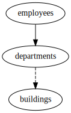

Compound Foreign Keys
---------------------

Schema
++++++

::

  CREATE TABLE buildings (
      id1 INTEGER,
      id2 INTEGER,
      name TEXT,
      PRIMARY KEY(id1, id2)
  );
  
  CREATE TABLE departments (
      id1 INTEGER,
      id2 INTEGER,
      name TEXT,
      building1_id INTEGER,
      building2_id INTEGER,
      FOREIGN KEY(building1_id, building2_id) REFERENCES buildings,
      UNIQUE(id1, id2)
  );
  
  CREATE TABLE employees (
      id1 INTEGER,
      id2 INTEGER,
      name TEXT,
      department1_id INTEGER NOT NULL,
      department2_id INTEGER NOT NULL,
      PRIMARY KEY(id1, id2),
      FOREIGN KEY(department1_id, department2_id) REFERENCES departments(id1, id2)
  );
  
  INSERT INTO buildings (id1, id2, name) VALUES
      (1, 1, 'London'),
      (2, 2, 'Paris');
  
  
  INSERT INTO departments (id1, id2, name, building1_id, building2_id) VALUES
      (1, 1, 'Research', 1, 1),
      (2, 2, 'Accounting', NULL, NULL);
  
  INSERT INTO employees (id1, id2, name, department1_id, department2_id) VALUES
      (1, 1, 'John', 1, 1 ),
      (2, 2, 'Jane', 1, 1),
      (3, 3, 'Janet', 2, 2);
  

.. _examples_compound_foreign_keys:

Compound Foreign Keys
+++++++++++++++++++++
This extremely convoluted example shows that compound key support is built in. Relations can also be used, but only one column is matched in the foreign key.

Config
::

  - relations:
    - {defaults: everything}
  - subject:
    - tables:
      - {table: departments}
  

Explain output
::

  departments*
  departments* -> departments.id1,id2=1,1 -> buildings.(id1,id2)=(1,1)
  departments* -> departments.id1,id2=1,1 -> employees.(department1_id,department2_id)=(1,1)
  departments* -> departments.id1,id2=2,2 -> employees.(department1_id,department2_id)=(2,2)
  departments* -> departments.id1,id2=1,1 -> buildings.(id1,id2)=(1,1) -> buildings.id1,id2=1,1 -> departments.(building1_id,building2_id)=(1,1)
  departments* -> departments.id1,id2=1,1 -> employees.(department1_id,department2_id)=(1,1) -> employees.id1,id2=1,1 -> departments.(id1,id2)=(1,1)
  departments* -> departments.id1,id2=2,2 -> employees.(department1_id,department2_id)=(2,2) -> employees.id1,id2=3,3 -> departments.(id1,id2)=(2,2)

Results
::

  INSERT INTO buildings (id1, id2, name) VALUES(1, 1, 'London');
  INSERT INTO departments (id1, id2, name, building1_id, building2_id) VALUES(1, 1, 'Research', 1, 1);
  INSERT INTO departments (id1, id2, name, building1_id, building2_id) VALUES(2, 2, 'Accounting', NULL, NULL);
  INSERT INTO employees (id1, id2, name, department1_id, department2_id) VALUES(1, 1, 'John', 1, 1);
  INSERT INTO employees (id1, id2, name, department1_id, department2_id) VALUES(2, 2, 'Jane', 1, 1);
  INSERT INTO employees (id1, id2, name, department1_id, department2_id) VALUES(3, 3, 'Janet', 2, 2);

