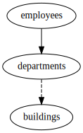

Defaults
--------

Schema
++++++

::

  CREATE TABLE buildings (
      id INTEGER PRIMARY KEY,
      name TEXT
  );
  
  CREATE TABLE departments (
      id INTEGER PRIMARY KEY,
      name TEXT,
      building_id INTEGER REFERENCES buildings
  );
  
  CREATE TABLE employees (
      id INTEGER PRIMARY KEY,
      name TEXT,
      department_id INTEGER NOT NULL REFERENCES departments
  );
  
  INSERT INTO buildings (id, name) VALUES
      (1, 'London'),
      (2, 'Paris');
  
  INSERT INTO departments (id, name, building_id) VALUES
      (1, 'Research', 1),
      (2, 'Accounting', NULL);
  
  INSERT INTO employees (id, name, department_id) VALUES
      (1, 'John', 1),
      (2, 'Jane', 1),
      (3, 'Janet', 2);
  

.. _example_relations_all_outgoing_not_null:

all-outgoing-not-null
+++++++++++++++++++++
``all-outgoing-not-null`` is the minimum required relation.
Nullable outgoing foreign keys are ignored, as well as incoming foreign keys.
Fetching all ``departments`` will make the ``building_id`` foreign key ``null``.
Also, since no incoming relations are in the defaults, no rows in ``employees`` are fetched.
If rows in ``buildings`` are required, they can be enabled by adding an ``outgoing`` relation from ``departments`` to ``buildings``. This will also make the ``null`` go away in the research department. See :ref:`outgoing_relation`.

Config
::

  - relations:
    - {defaults: all-outgoing-not-null}
  - subject:
    - tables:
      - {table: departments}
  

Explain output
::

  departments*

Results
::

  INSERT INTO departments (id, name, building_id) VALUES(1, 'Research', NULL);
  INSERT INTO departments (id, name, building_id) VALUES(2, 'Accounting', NULL);

.. _example_relations_all_outgoing_nullable:

all-outgoing-nullable
+++++++++++++++++++++
``all-outgoing-nullable`` ensures that all foreign keys are processed.
In this example it means that the ``buildings`` row with id=1 must be fetched to satisfy the ``building_id`` foreign key constraint on the ``departments`` table.
Also, since no incoming relations are in the defaults, no rows in ``employees`` are fetched.

Config
::

  - relations:
    - {defaults: all-outgoing-nullable}
  - subject:
    - tables:
      - {table: departments}
  

Explain output
::

  departments*
  departments* -> departments.id=1 -> buildings.id=1

Results
::

  INSERT INTO buildings (id, name) VALUES(1, 'London');
  INSERT INTO departments (id, name, building_id) VALUES(1, 'Research', 1);
  INSERT INTO departments (id, name, building_id) VALUES(2, 'Accounting', NULL);

.. _example_relations_all_incoming:

all-incoming
++++++++++++
``all-incoming`` ensures that for any row that is fetched all *referencing* foreign keys are processed in other tables.
In this example it means that that all ``employees`` with ``department_id`` in the fetched departments are fetched.
Note how no rows in ``buildings`` are fetched, since ``all-outgoing-nullable`` wasn't enabled.

Config
::

  - relations:
    - {defaults: all-incoming}
  - subject:
    - tables:
      - {table: departments}
  

Explain output
::

  departments*
  departments* -> departments.id=1 -> employees.department_id=1
  departments* -> departments.id=2 -> employees.department_id=2
  departments* -> departments.id=1 -> employees.department_id=1 -> employees.id=1 -> departments.id=1
  departments* -> departments.id=2 -> employees.department_id=2 -> employees.id=3 -> departments.id=2

Results
::

  INSERT INTO departments (id, name, building_id) VALUES(1, 'Research', NULL);
  INSERT INTO departments (id, name, building_id) VALUES(2, 'Accounting', NULL);
  INSERT INTO employees (id, name, department_id) VALUES(1, 'John', 1);
  INSERT INTO employees (id, name, department_id) VALUES(2, 'Jane', 1);
  INSERT INTO employees (id, name, department_id) VALUES(3, 'Janet', 2);

.. _example_relations_all_incoming_and_all_outgoing_nullable:

all-incoming and all-outgoing-nullable
++++++++++++++++++++++++++++++++++++++
The combination of ``all-outgoing-nullable`` and ``all-incoming``, which is equivalent to :ref:`example_relations_everything`, fetches everything in ``buildings`` and ``employees`` related to all the ``departments``.

Config
::

  - relations:
    - {defaults: all-outgoing-nullable}
    - {defaults: all-incoming}
  - subject:
    - tables:
      - {table: departments}
  

Explain output
::

  departments*
  departments* -> departments.id=1 -> employees.department_id=1
  departments* -> departments.id=2 -> employees.department_id=2
  departments* -> departments.id=1 -> buildings.id=1
  departments* -> departments.id=1 -> employees.department_id=1 -> employees.id=1 -> departments.id=1
  departments* -> departments.id=2 -> employees.department_id=2 -> employees.id=3 -> departments.id=2
  departments* -> departments.id=1 -> buildings.id=1 -> departments.building_id=1

Results
::

  INSERT INTO buildings (id, name) VALUES(1, 'London');
  INSERT INTO departments (id, name, building_id) VALUES(1, 'Research', 1);
  INSERT INTO departments (id, name, building_id) VALUES(2, 'Accounting', NULL);
  INSERT INTO employees (id, name, department_id) VALUES(1, 'John', 1);
  INSERT INTO employees (id, name, department_id) VALUES(2, 'Jane', 1);
  INSERT INTO employees (id, name, department_id) VALUES(3, 'Janet', 2);

.. _example_relations_everything:

everything
++++++++++
This is equivalent to the above :ref:`example_relations_all_incoming_and_all_outgoing_nullable`

Config
::

  - relations:
    - {defaults: everything}
  - subject:
    - tables:
      - {table: departments}
  

Explain output
::

  departments*
  departments* -> departments.id=1 -> employees.department_id=1
  departments* -> departments.id=2 -> employees.department_id=2
  departments* -> departments.id=1 -> buildings.id=1
  departments* -> departments.id=1 -> employees.department_id=1 -> employees.id=1 -> departments.id=1
  departments* -> departments.id=2 -> employees.department_id=2 -> employees.id=3 -> departments.id=2
  departments* -> departments.id=1 -> buildings.id=1 -> departments.building_id=1

Results
::

  INSERT INTO buildings (id, name) VALUES(1, 'London');
  INSERT INTO departments (id, name, building_id) VALUES(1, 'Research', 1);
  INSERT INTO departments (id, name, building_id) VALUES(2, 'Accounting', NULL);
  INSERT INTO employees (id, name, department_id) VALUES(1, 'John', 1);
  INSERT INTO employees (id, name, department_id) VALUES(2, 'Jane', 1);
  INSERT INTO employees (id, name, department_id) VALUES(3, 'Janet', 2);

