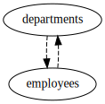

Not Null Columns
----------------

Schema
++++++

::

  CREATE TABLE departments (
      id INTEGER PRIMARY KEY,
      name TEXT
  );
  
  CREATE TABLE employees (
      id INTEGER PRIMARY KEY,
      name TEXT,
      department_id INTEGER REFERENCES departments
  );
  
  ALTER TABLE departments ADD COLUMN primary_employee_id INTEGER REFERENCES employees;
  
  INSERT INTO departments (id, name) VALUES
      (1, 'Managers'),
      (2, 'Engineers');
  
  INSERT INTO employees (id, name, department_id) VALUES
      (1, 'John', 1),
      (2, 'Jane', 2),
      (3, 'Janet', NULL);
  
  UPDATE departments SET primary_employee_id=1 WHERE id=1;
  

.. _examples_not_null_columns1:

Not Null Columns
++++++++++++++++
In this example, two tables, ``departments`` and ``employees`` both reference each other with nullable foreign keys.
It makes no difference to the SQL generation which table comes first when generating the  ``INSERT`` statements, so they are processed in alphabetical order with the ``departments`` table getting insert statements generated first.
The value for ``primary_employee_id`` can't be added until the rows have been inserted in to the ``employees`` table
so an ``UPDATE`` statement for ``departments`` is needed after the ``employees`` rows have been inserted.

Config
::

  - subject:
    - tables:
      - {table: departments}
    - relations:
      - {column: department_id, table: employees}
  

Explain output
::

  departments*
  departments* -> departments.id=1 -> employees.department_id=1
  departments* -> departments.id=2 -> employees.department_id=2
  departments* -> departments.id=1 -> employees.id=1
  departments* -> departments.id=1 -> employees.department_id=1 -> employees.id=1 -> departments.id=1
  departments* -> departments.id=2 -> employees.department_id=2 -> employees.id=2 -> departments.id=2

Results
::

  INSERT INTO departments (id, name, primary_employee_id) VALUES(1, 'Managers', NULL);
  INSERT INTO departments (id, name, primary_employee_id) VALUES(2, 'Engineers', NULL);
  INSERT INTO employees (id, name, department_id) VALUES(1, 'John', 1);
  INSERT INTO employees (id, name, department_id) VALUES(2, 'Jane', 2);
  UPDATE departments SET primary_employee_id=1 WHERE id=1;

.. _examples_not_null_columns2:

Not Null Columns Switched
+++++++++++++++++++++++++
Let's pretend there is some reason why a row can't be inserted into ``departments`` without ``primary_employee_id`` being set due to a ``CHECK`` constraint.
The SQL generation engine can be given a hint by using a ``not-null-columns`` rule. This results in the tables being processed in reverse order with ``employees`` getting inserts first, then ``departments``.
This results in the rows in the ``departments`` table having ``primary_employee_id`` set in the ``INSERT`` statement. The consequence of this is that the ``department_id`` on ``employees`` must be set late with an ``UPDATE`` statement.

Config
::

  - not-null-columns:
    - {column: primary_employee_id, table: departments}
  - subject:
    - tables:
      - {table: departments}
    - relations:
      - {column: department_id, table: employees}
  

Explain output
::

  departments*
  departments* -> departments.id=1 -> employees.department_id=1
  departments* -> departments.id=2 -> employees.department_id=2
  departments* -> departments.id=1 -> employees.id=1
  departments* -> departments.id=1 -> employees.department_id=1 -> employees.id=1 -> departments.id=1
  departments* -> departments.id=2 -> employees.department_id=2 -> employees.id=2 -> departments.id=2

Results
::

  INSERT INTO employees (id, name, department_id) VALUES(1, 'John', NULL);
  INSERT INTO employees (id, name, department_id) VALUES(2, 'Jane', NULL);
  INSERT INTO departments (id, name, primary_employee_id) VALUES(1, 'Managers', 1);
  INSERT INTO departments (id, name, primary_employee_id) VALUES(2, 'Engineers', NULL);
  UPDATE employees SET department_id=1 WHERE id=1;
  UPDATE employees SET department_id=2 WHERE id=2;

