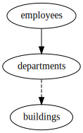

Relations
---------

Schema
++++++

::

  CREATE TABLE buildings (
      id INTEGER PRIMARY KEY,
      name TEXT
  );
  
  CREATE TABLE departments (
      id INTEGER PRIMARY KEY,
      name TEXT,
      building_id INTEGER REFERENCES buildings
  );
  
  CREATE TABLE employees (
      id INTEGER PRIMARY KEY,
      name TEXT,
      department_id INTEGER NOT NULL REFERENCES departments
  );
  
  INSERT INTO buildings (id, name) VALUES
      (1, 'London'),
      (2, 'Paris');
  
  INSERT INTO departments (id, name, building_id) VALUES
      (1, 'Research', 1),
      (2, 'Accounting', NULL);
  
  INSERT INTO employees (id, name, department_id) VALUES
      (1, 'John', 1),
      (2, 'Jane', 1),
      (3, 'Janet', 2);
  

.. _example_default_relations_for_a_department:

Default relations for a department
++++++++++++++++++++++++++++++++++
By default, whenever a row is seen, everything is done to ensure the row is complete.
Since the ``departments`` table contains a foreign key on ``building_id``, all buildings referenced from departments will be also fetched.
However rows referencing the department aren't fetched.

Config
::

  - subject:
    - tables:
      - {column: name, table: departments, values: Research}
  

Explain output
::

  departments.name=Research*
  departments.name=Research* -> departments.id=1 -> buildings.id=1

Results
::

  INSERT INTO buildings (id, name) VALUES(1, 'London');
  INSERT INTO departments (id, name, building_id) VALUES(1, 'Research', 1);

.. _incoming_relation1:

Incoming Relation
+++++++++++++++++
This does an extraction with a relation from ``employees`` to ``departments``. This will include both employees in the research department.
Note how rows in ``buildings`` are also included since by the default all outgoing foreign keys are fetched. See :ref:`defaults` for more details.
The ``type`` of ``incoming`` doesn't have to be included in the config since this is the default.

Config
::

  - subject:
    - tables:
      - {column: name, table: departments, values: Research}
    - relations:
      - {column: department_id, table: employees}
  

Explain output
::

  departments.name=Research*
  departments.name=Research* -> departments.id=1 -> buildings.id=1
  departments.name=Research* -> departments.id=1 -> employees.department_id=1
  departments.name=Research* -> departments.id=1 -> employees.department_id=1 -> employees.id=1 -> departments.id=1

Results
::

  INSERT INTO buildings (id, name) VALUES(1, 'London');
  INSERT INTO departments (id, name, building_id) VALUES(1, 'Research', 1);
  INSERT INTO employees (id, name, department_id) VALUES(1, 'John', 1);
  INSERT INTO employees (id, name, department_id) VALUES(2, 'Jane', 1);

.. _example_relations_two_departments1:

Relation for two departments 1
++++++++++++++++++++++++++++++
This does an extraction with the above relation, but with both departments.
This ends up fetching all employees.

Config
::

  - subject:
    - tables:
      - column: name
        table: departments
        values: [Research, Accounting]
    - relations:
      - {column: department_id, table: employees}
  

Explain output
::

  departments.name=Research*
  departments.name=Research* -> departments.id=1 -> buildings.id=1
  departments.name=Research* -> departments.id=1 -> employees.department_id=1
  departments.name=Research* -> departments.id=2 -> employees.department_id=2
  departments.name=Research* -> departments.id=1 -> employees.department_id=1 -> employees.id=1 -> departments.id=1
  departments.name=Research* -> departments.id=2 -> employees.department_id=2 -> employees.id=3 -> departments.id=2

Results
::

  INSERT INTO buildings (id, name) VALUES(1, 'London');
  INSERT INTO departments (id, name, building_id) VALUES(1, 'Research', 1);
  INSERT INTO departments (id, name, building_id) VALUES(2, 'Accounting', NULL);
  INSERT INTO employees (id, name, department_id) VALUES(1, 'John', 1);
  INSERT INTO employees (id, name, department_id) VALUES(2, 'Jane', 1);
  INSERT INTO employees (id, name, department_id) VALUES(3, 'Janet', 2);

.. _example_relations_two_departments2:

Relation for two departments 2
++++++++++++++++++++++++++++++
This is equivalent to :ref:`example_relations_two_departments1`, except it used two separate table sections.

Config
::

  - relations:
    - {column: department_id, table: employees}
  - subject:
    - tables:
      - {column: id, table: departments, values: 1}
      - {column: id, table: departments, values: 2}
  

Explain output
::

  departments.id=1*
  departments.id=2*
  departments.id=1* -> departments.id=1 -> buildings.id=1
  departments.id=1* -> departments.id=1 -> employees.department_id=1
  departments.id=2* -> departments.id=2 -> employees.department_id=2
  departments.id=1* -> departments.id=1 -> employees.department_id=1 -> employees.id=1 -> departments.id=1
  departments.id=2* -> departments.id=2 -> employees.department_id=2 -> employees.id=3 -> departments.id=2

Results
::

  INSERT INTO buildings (id, name) VALUES(1, 'London');
  INSERT INTO departments (id, name, building_id) VALUES(1, 'Research', 1);
  INSERT INTO departments (id, name, building_id) VALUES(2, 'Accounting', NULL);
  INSERT INTO employees (id, name, department_id) VALUES(1, 'John', 1);
  INSERT INTO employees (id, name, department_id) VALUES(2, 'Jane', 1);
  INSERT INTO employees (id, name, department_id) VALUES(3, 'Janet', 2);

.. _example_relations_two_departments3:

Relation for two departments 3
++++++++++++++++++++++++++++++
This is equivalent to :ref:`example_relations_two_departments1`, except it used two separate subjects.

Config
::

  - relations:
    - {column: department_id, table: employees}
  - subject:
    - tables:
      - {column: id, table: departments, values: 1}
  - subject:
    - tables:
      - {column: name, table: departments, values: Accounting}
  

Explain output
::

  departments.id=1*
  departments.name=Accounting*
  departments.id=1* -> departments.id=1 -> buildings.id=1
  departments.id=1* -> departments.id=1 -> employees.department_id=1
  departments.name=Accounting* -> departments.id=2 -> employees.department_id=2
  departments.id=1* -> departments.id=1 -> employees.department_id=1 -> employees.id=1 -> departments.id=1
  departments.name=Accounting* -> departments.id=2 -> employees.department_id=2 -> employees.id=3 -> departments.id=2

Results
::

  INSERT INTO buildings (id, name) VALUES(1, 'London');
  INSERT INTO departments (id, name, building_id) VALUES(1, 'Research', 1);
  INSERT INTO departments (id, name, building_id) VALUES(2, 'Accounting', NULL);
  INSERT INTO employees (id, name, department_id) VALUES(1, 'John', 1);
  INSERT INTO employees (id, name, department_id) VALUES(2, 'Jane', 1);
  INSERT INTO employees (id, name, department_id) VALUES(3, 'Janet', 2);

.. _example_relations_an_employee:

Relation for an employee
++++++++++++++++++++++++
A subject to fetch the John employee with the ``everything`` default leads to all employees in the research department being fetched since:

- John belongs to the research department
- All employees in the research department are fetched, which pulls in Jane

Config
::

  - relations:
    - {defaults: everything}
  - subject:
    - tables:
      - {column: name, table: employees, values: John}
  

Explain output
::

  employees.name=John*
  employees.name=John* -> employees.id=1 -> departments.id=1
  employees.name=John* -> employees.id=1 -> departments.id=1 -> buildings.id=1
  employees.name=John* -> employees.id=1 -> departments.id=1 -> employees.department_id=1
  employees.name=John* -> employees.id=1 -> departments.id=1 -> buildings.id=1 -> departments.building_id=1

Results
::

  INSERT INTO buildings (id, name) VALUES(1, 'London');
  INSERT INTO departments (id, name, building_id) VALUES(1, 'Research', 1);
  INSERT INTO employees (id, name, department_id) VALUES(1, 'John', 1);
  INSERT INTO employees (id, name, department_id) VALUES(2, 'Jane', 1);

.. _outgoing_relation:

Outgoing relation
+++++++++++++++++
This shows the explicit enabling of an outgoing nullable relation when using the minimal defaults of ``all-outgoing-not-null``.
Without the relation, no rows in the ``buildings`` table would be fetched, since the default rules don't including following nullable foreign keys as described on :ref:`example_relations_all_outgoing_not_null`.
In this example, the relation is enabled, resulting in building being included.

Config
::

  - relations:
    - {defaults: all-outgoing-not-null}
  - subject:
    - tables:
      - column: name
        table: departments
        values: [Research, Accounting]
    - relations:
      - {column: building_id, table: departments, type: outgoing}
  

Explain output
::

  departments.name=Research*
  departments.name=Research* -> departments.id=1 -> buildings.id=1

Results
::

  INSERT INTO buildings (id, name) VALUES(1, 'London');
  INSERT INTO departments (id, name, building_id) VALUES(1, 'Research', 1);
  INSERT INTO departments (id, name, building_id) VALUES(2, 'Accounting', NULL);

.. _example_relations_disabled_incoming:

Disabled incoming relation
++++++++++++++++++++++++++
This demonstrates the blacklisting approach. All relations are enabled by default,
however the relation from ``employees`` to ``departments`` is disabled.
Fetching a department will therefore not fetch any of the employees.

This is an ``incoming`` relationship type from the perspective of the ``employees`` table.
The ``type`` key doesn't have to be included since the default type is ``incoming``.
Relations can be disabled globally or per subject.

Config
::

  - relations:
    - {defaults: everything}
  - subject:
    - tables:
      - column: name
        table: departments
        values: [Research, Accounting]
    - relations:
      - {column: department_id, disabled: true, table: employees}
  

Explain output
::

  departments.name=Research*
  departments.name=Research* -> departments.id=1 -> buildings.id=1
  departments.name=Research* -> departments.id=1 -> buildings.id=1 -> departments.building_id=1

Results
::

  INSERT INTO buildings (id, name) VALUES(1, 'London');
  INSERT INTO departments (id, name, building_id) VALUES(1, 'Research', 1);
  INSERT INTO departments (id, name, building_id) VALUES(2, 'Accounting', NULL);

.. _example_relations_disabled_outgoing:

Disabled outgoing relation
++++++++++++++++++++++++++
This is another example of the blacklisting approach. All relations are enabled by default,
however the relation from ``departments`` to ``buildings`` is disabled.
Fetching a department will therefore not fetch any of the buildings.
This is an ``outgoing`` relationship type from the perspective of the ``departments`` table due to the ``building_id`` foreign key.
A side effect of disabling this relation is that ``building_id`` becomes ``null`` for the "Research" department, even though the "Research" department is associated with the "London" building.

Config
::

  - relations:
    - {defaults: everything}
  - subject:
    - tables:
      - column: name
        table: departments
        values: [Research, Accounting]
    - relations:
      - {column: building_id, disabled: true, table: departments, type: outgoing}
  

Explain output
::

  departments.name=Research*
  departments.name=Research* -> departments.id=1 -> employees.department_id=1
  departments.name=Research* -> departments.id=2 -> employees.department_id=2
  departments.name=Research* -> departments.id=1 -> employees.department_id=1 -> employees.id=1 -> departments.id=1
  departments.name=Research* -> departments.id=2 -> employees.department_id=2 -> employees.id=3 -> departments.id=2

Results
::

  INSERT INTO departments (id, name, building_id) VALUES(1, 'Research', NULL);
  INSERT INTO departments (id, name, building_id) VALUES(2, 'Accounting', NULL);
  INSERT INTO employees (id, name, department_id) VALUES(1, 'John', 1);
  INSERT INTO employees (id, name, department_id) VALUES(2, 'Jane', 1);
  INSERT INTO employees (id, name, department_id) VALUES(3, 'Janet', 2);

