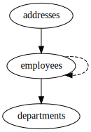

Sticky Relations
----------------

Schema
++++++

::

  CREATE TABLE departments (
      id INTEGER PRIMARY KEY,
      name TEXT
  );
  
  CREATE TABLE employees (
      id INTEGER PRIMARY KEY,
      name TEXT,
      department_id INTEGER NOT NULL REFERENCES departments
  );
  
  ALTER TABLE employees ADD COLUMN boss_id INTEGER REFERENCES employees;
  
  CREATE TABLE addresses (
      id INTEGER PRIMARY KEY,
      employee_id INTEGER NOT NULL REFERENCES employees,
      details TEXT
  );
  
  INSERT INTO departments (id, name) VALUES
      (1, 'Managers'),
      (2, 'Engineers');
  
  INSERT INTO employees (id, name, department_id, boss_id) VALUES
      (1, 'John', 1, NULL),
      (2, 'Jane', 2, 1),
      (3, 'Janet', 2, 2);
  
  INSERT INTO addresses (id, employee_id, details) VALUES
      (1, 1, 'John''s address'),
      (2, 2, 'Jane''s adddress'),
      (3, 3, 'Janet''s first address'),
      (4, 3, 'Janet''s second address');
  

.. _examples_sticky_relations:

Sticky Relations
++++++++++++++++
Let's say we want to have a database with all engineers in the engineering department and include all engineer's addresses.
We want to specifically *not* include manager's addresses. If we were to simply add relations from ``employees`` to ``departments`` and ``addresses`` to ``employees``, then any employee's boss would trigger a fetch from the management department, which would lead to all employee's managers being fetched, which would lead to all manager's addresses being fetched.

By making relations `sticky`, they are only processed if there is a sticky trail all the way back to a subject.
If we set the sticky flag on the ``department_id`` and ``employee_id`` foreign keys, then these relationships are `only` processed if there is a direct trail back to a subject.
When the ``boss_id`` foreign key is processed, the sticky flag is dropped.
Therefore, when the "John" employee is processed, the sticky flag has been lost and the sticky relationships aren't used, resulting in no addresses being fetched for John.
This can be seen in the explain output in the lines where the employee to boss relationship is processed: the asterisks, indicating stickiness, disappear.

Config
::

  - subject:
    - tables:
      - {column: name, table: departments, values: Engineers}
    - relations:
      - {column: department_id, sticky: true, table: employees}
      - {column: employee_id, sticky: true, table: addresses}
  

Explain output
::

  departments.name=Engineers*
  departments.name=Engineers* -> departments.id=2* -> employees.department_id=2*
  departments.name=Engineers* -> departments.id=2* -> employees.department_id=2* -> employees.id=2 -> departments.id=2
  departments.name=Engineers* -> departments.id=2* -> employees.department_id=2* -> employees.id=2 -> employees.id=1
  departments.name=Engineers* -> departments.id=2* -> employees.department_id=2* -> employees.id=3 -> employees.id=2
  departments.name=Engineers* -> departments.id=2* -> employees.department_id=2* -> employees.id=2* -> addresses.employee_id=2*
  departments.name=Engineers* -> departments.id=2* -> employees.department_id=2* -> employees.id=3* -> addresses.employee_id=3*
  departments.name=Engineers* -> departments.id=2* -> employees.department_id=2* -> employees.id=2 -> employees.id=1 -> departments.id=1
  departments.name=Engineers* -> departments.id=2* -> employees.department_id=2* -> employees.id=3* -> addresses.employee_id=3* -> addresses.id=3 -> employees.id=3

Results
::

  INSERT INTO departments (id, name) VALUES(1, 'Managers');
  INSERT INTO departments (id, name) VALUES(2, 'Engineers');
  INSERT INTO employees (id, name, department_id, boss_id) VALUES(1, 'John', 1, NULL);
  INSERT INTO employees (id, name, department_id, boss_id) VALUES(2, 'Jane', 2, NULL);
  INSERT INTO employees (id, name, department_id, boss_id) VALUES(3, 'Janet', 2, NULL);
  INSERT INTO addresses (id, employee_id, details) VALUES(2, 2, 'Jane''s adddress');
  INSERT INTO addresses (id, employee_id, details) VALUES(3, 3, 'Janet''s first address');
  INSERT INTO addresses (id, employee_id, details) VALUES(4, 3, 'Janet''s second address');
  UPDATE employees SET boss_id=1 WHERE id=2;
  UPDATE employees SET boss_id=2 WHERE id=3;

