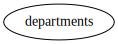

Subjects
--------

Schema
++++++

::

  CREATE TABLE departments (
      id INTEGER PRIMARY KEY,
      name TEXT
  );
  
  INSERT INTO departments (id, name) VALUES
      (1, 'Research'),
      (2, 'Accounting'),
      (3, 'Finance');
  

.. _example_subjects_all_departments:

All departments
+++++++++++++++
A table entry with just a table name will fetch all rows.

Config
::

  - subject:
    - tables:
      - {table: departments}
  

Explain output
::

  departments*

Results
::

  INSERT INTO departments (id, name) VALUES(1, 'Research');
  INSERT INTO departments (id, name) VALUES(2, 'Accounting');
  INSERT INTO departments (id, name) VALUES(3, 'Finance');

.. _example_subjects_one_department:

One department
++++++++++++++
A table entry with a single column/value will fetch one row.

Config
::

  - subject:
    - tables:
      - {column: name, table: departments, values: Research}
  

Explain output
::

  departments.name=Research*

Results
::

  INSERT INTO departments (id, name) VALUES(1, 'Research');

.. _example_subjects_two_departments:

Two departments
+++++++++++++++
A table entry with multiple column/values will fetch multiple rows.

Config
::

  - subject:
    - tables:
      - column: name
        table: departments
        values: [Research, Accounting]
  

Explain output
::

  departments.name=Research*

Results
::

  INSERT INTO departments (id, name) VALUES(1, 'Research');
  INSERT INTO departments (id, name) VALUES(2, 'Accounting');

.. _example_subjects_two_tables:

Two tables
++++++++++
A subject can have multiple tables.

Config
::

  - subject:
    - tables:
      - {column: name, table: departments, values: Accounting}
      - {column: name, table: departments, values: Research}
  

Explain output
::

  departments.name=Accounting*
  departments.name=Research*

Results
::

  INSERT INTO departments (id, name) VALUES(1, 'Research');
  INSERT INTO departments (id, name) VALUES(2, 'Accounting');

.. _example_subjects_two_subjects:

Two subjects
++++++++++++
Subjects can have different tables and relations.
This example is a bit silly since both departments can be done in the same subject,
it just illustrates that things can be broken down.

Config
::

  - subject:
    - tables:
      - {column: name, table: departments, values: Accounting}
  - subject:
    - tables:
      - {column: name, table: departments, values: Research}
  

Explain output
::

  departments.name=Accounting*
  departments.name=Research*

Results
::

  INSERT INTO departments (id, name) VALUES(1, 'Research');
  INSERT INTO departments (id, name) VALUES(2, 'Accounting');

